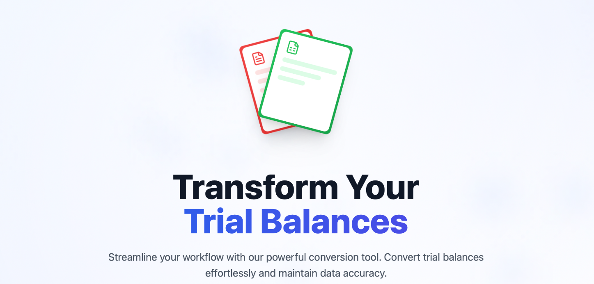
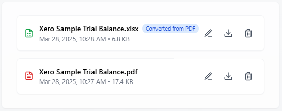

# Conv3rt - Financial Statement Standardizer

# Introduction
Conv3rt is an AI-powered web application designed to automate the mapping and conversion of trial balances from various formats into a standardized schema. Moreover, by reducing manual cleanup and classification of accounts, Conv3rt helps accountants onboard new companies quickly and accurately.

## Hackathon Recognition
Pitched the solution at NTU CAO “Code with AI” Hackathon winning **1st Place** (SGD 1,000)
### Team Members
- Mengyi
- Yuanchi 
- Florian
- Yuancheng 
- Xiong Kai

## Motive

Accountants and financial teams often receive trial balances in inconsistent formats from different accounting software. Manually reformatting these spreadsheets and classifying account codes is time-consuming and error-prone. Conv3rt’s core motive is to leverage AI (OpenAI API) for automatic account classification and formatting, ensuring:
- **Reduced Errors**: Automated AI-driven classification minimizes human mistakes.
- **Consistent Formatting**: Every output follows a strict schema, guaranteeing compatibility with downstream systems.
## Video Demonstration

## Key Features
- **Multi-format Upload**  
  - Accepts `.xls`, `.xlsx` and `.pdf` trial balance exports  
  - In-browser preview for Excel tables and PDF pages
  - PDFs can easily be converted to Excel through OCR 

  
- **AI-Powered Account Classification**  
  - Sends each trial balance line item to the OpenAI API for multi-level account classification (Type, Primary, Secondary, Tertiary)  
  - Uses a prompt template:  
    > “You are a professional accountant with expertise in financial statement classification. You have access to a comprehensive classification structure for trial balance entries.”  
  - Stores AI’s predicted categories alongside raw data   

